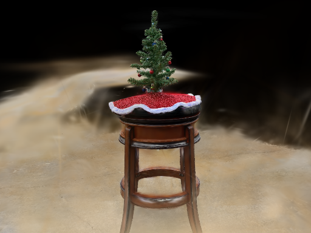

# gsplat_mojo

3D Gaussian Splatting rendering kernels implemented in [Mojo](https://www.modular.com/mojo), targeting GPU acceleration via Modular's MAX platform.

> **Status:** Built against current Mojo (`1.1.0.dev`). The forward pass runs
> end to end on GPU — PLY load, spherical harmonics, projection, tile binning,
> GPU radix depth sort, and rasterization — and renders
> `assets/christmas_tree.ply` (329k gaussians). Reachable both natively and as
> a MAX custom op. Verified pixel-exactly against independent references on
> synthetic scenes and against a float64 reference on the real one. There is
> no backward pass.

## Project Structure

```
gsplat_mojo/
├── assets/
│   └── christmas_tree.ply          # Sample 3DGS model (329k gaussians)
├── driver.py                       # Runs the custom op via a MAX graph
├── gsplat/
│   ├── mojoproject.toml            # Mojo project config (read by pixi)
│   ├── gsplat_kernels/             # Mojo package — precompiles to .mojoc
│   │   ├── config.mojo             #   sizes, constants and tensor layouts
│   │   ├── vec.mojo                #   Vec3 / Vec4
│   │   ├── utils_t.mojo            #   Mat3 / Mat2, rotations, quaternions
│   │   ├── ply.mojo                #   INRIA-format 3DGS PLY loader
│   │   ├── spherical_harmonics.mojo#   view-dependent colour pre-pass
│   │   ├── intersect.mojo          #   tile binning, scan, radix depth sort
│   │   ├── rasterize.mojo          #   the ray/gaussian rasterization kernel
│   │   └── render.mojo             #   MAX custom op wrapping the pipeline
│   └── tests/                      # executables — a package cannot hold main()
│       ├── scene.mojo              #   deterministic synthetic scenes
│       ├── refmath.mojo            #   float32/float64 host reference
│       ├── forward_test.mojo       #   rasterizer, 3 phases
│       ├── intersect_test.mojo     #   binning + sort vs a serial reference
│       ├── sh_test.mojo            #   SH vs a closed-form basis
│       └── render_ply.mojo         #   renders a real PLY and verifies it
└── README.md
```

The kernels are a real Mojo package rather than loose files because MAX loads
custom extensions from a `.mojoc`, and a package cannot contain a `main()`.

### Key Files

| File | Description |
|------|-------------|
| `gsplat_kernels/config.mojo` | Sizes, compositing cutoffs, radix/scan geometry, and every tensor layout |
| `gsplat_kernels/vec.mojo` | SIMD-backed `Vec3` / `Vec4` |
| `gsplat_kernels/utils_t.mojo` | `Mat3`/`Mat2` value types, quaternion and rotation helpers |
| `gsplat_kernels/ply.mojo` | Parses binary 3DGS PLY and undoes the trainer's parameterization |
| `gsplat_kernels/spherical_harmonics.mojo` | Resolves SH coefficients to RGB for the current camera |
| `gsplat_kernels/intersect.mojo` | Projection, tile bounding, two-level scan, LSD radix sort, tile offsets |
| `gsplat_kernels/rasterize.mojo` | Ray/gaussian rasterization kernel |
| `gsplat_kernels/render.mojo` | `@register("render")` custom op wrapping the whole pipeline |

## Running the checks

```bash
cd gsplat
pixi run forward     # rasterizer, 3 phases
pixi run intersect   # binning + radix sort, vs a serial reference and vs bitonic
pixi run sh          # spherical harmonics vs a closed-form basis
pixi run render-ply  # render assets/christmas_tree.ply -> render.ppm
pixi run package     # build gsplat_kernels.mojoc for MAX
pixi run python ../driver.py   # run the custom op and diff against render.ppm
```

`render.ppm` is a plain binary PPM; convert it with
`pnmtopng render.ppm > render.png` or `magick render.ppm render.png`.

## Prerequisites

- **Linux x86_64** (only platform currently supported)
- **GPU** with driver support for Modular MAX
- [pixi](https://pixi.sh) — manages the Mojo/MAX toolchain and environment

Install pixi:
```bash
curl -fsSL https://pixi.sh/install.sh | sh
```

> The `magic` CLI this project originally used has been retired by Modular.
> `pixi` reads the same `mojoproject.toml`, so no manifest change was needed.

## Setup

Clone the repo and install dependencies:

```bash
git clone https://github.com/<your-user>/gsplat_mojo.git
cd gsplat_mojo/gsplat
pixi install
```

This reads `mojoproject.toml`, resolves dependencies (including the MAX/Mojo nightly toolchain), and creates the environment under `.pixi/`.

## Running

All commands should be run from the `gsplat/` directory.

### Run the forward rasterization kernel

The main entry point is in `operations/gsplat_forward.mojo`. Project tasks in
`mojoproject.toml` handle include paths; the manual form is:

```bash
pixi run mojo run -I . operations/gsplat_forward.mojo
```

### Format code

```bash
pixi run mojo format .
```

## Current State

The whole forward pipeline runs on GPU:

```
load PLY -> resolve SH -> project & count -> two-level prefix sum
         -> emit (tile, depth) keys -> radix sort -> tile offsets -> rasterize
```

### Rendering a real scene

`pixi run render-ply` loads all 329,004 gaussians of
`assets/christmas_tree.ply`, renders at 1024x768, and writes `render.ppm`:



```
gaussians: 329004 | SH degree 0 ( 1 coefficients )
tile intersections: 2258276
radix sort: 11 passes over 1103 blocks
coverage: 723850 of 786432 px lit ( 92 % ) | mean alpha 0.606
max |GPU      - float64 truth| 0.0162   mean 3.29e-05
max |host f32 - float64 truth| 0.0174   mean 3.11e-05   <- float32 noise floor
```

A whole-image host reference is not affordable at this scale, so 4096 spread
pixels are recomputed on the host from the tile lists the GPU actually
produced. **The bar is not a fixed tolerance.** These gaussians are ~1e-3
across and ~5 units away, so the intersection ends in `p = og + t*·dg`, a
near-total cancellation; evaluating it in float32 is genuinely uncertain. The
float32 host reference misses the float64 truth by *more* than the GPU does,
so the test asserts the GPU is no worse than an independent float32
evaluation rather than demanding better-than-float32.

That conditioning has a visible consequence: a **one-ulp** change to the focal
length measurably shifts the image. It is why `driver.py` computes its focal
stepwise in float32 to match the Mojo constant bit for bit.

### The sort

The depth sort is an LSD radix sort with 4-bit digits, run over only the bits
the key uses (12 tile bits + 32 depth bits = 11 passes rather than 16). It
replaced a bitonic sort, which is kept as a reference implementation for the
test to check against:

```
elements: 2258276 (bitonic padded to 4194304)
radix  : 11 passes, 1103 blocks ->  15.5 ms
bitonic: 253 passes             ->  90.6 ms
speedup: 5.86x        key streams differ in 0 of 2258276 slots
```

Stability is what makes LSD radix correct at all, and it comes from summing
three in-order offsets: the scanned per-(digit, block) base, the thread's slot
within its block's run of that digit, and a running count over the thread's
own elements.

### Spherical harmonics

Colour is view-dependent. `compute_colors_from_sh` resolves SH coefficients to
RGB for the current camera as a pre-pass, so the rasterizer still reads plain
RGB and needs no knowledge of SH. Degrees 0-3 are supported.

`assets/christmas_tree.ply` is **degree 0**, so it cannot exercise this path —
`pixi run sh` drives it directly instead, checking that degree 0 reduces
exactly to `C0*c0 + 0.5`, that degree 3 matches a host evaluation whose basis
constants are written as closed forms (`0.5*sqrt(1/pi)` and friends, so a
mistyped literal is caught), and that moving the camera actually changes the
colours.

### Synthetic self-checks

`pixi run forward` renders 24 gaussians into 1024x768 and checks **every**
pixel three ways:

| Phase | Scene | Checked against | Max error |
|-------|-------|-----------------|-----------|
| 1 | isotropic, on optical axis, identity camera | closed form `rho^2 = z^2 w / ((1+w) s^2)` | 1.5e-07 |
| 2 | rotated, anisotropic, off-axis; yawed + translated camera | `_ref_rho2`, a scalar reference written from the definitions | 1.3e-06 |
| 3 | same as 2, binned and depth-sorted by the real intersection stage | the phase 2 image (brute force) | **0.0** |

Phase 3 is exact: real binning visits 1367 tile/gaussian pairs instead of
73728, a **54x** reduction, and reproduces the brute-force image bit for bit.

All of it is mutation-tested rather than merely green:

| Mutation | Caught by |
|----------|-----------|
| `transpose(rotation)` -> `rotation` in `S^-1 R^T` | phase 2 (50k px); phase 1 still passes |
| skip the sort entirely | `intersect`: 2111 bad offsets, 902 bad tile sets |
| shrink the footprint bound to 0.6x | phase 3: 32657 px differing; `intersect` still passes |

### The MAX custom op

`gsplat_kernels/render.mojo` exposes the pipeline as `@register("render")`.
The port from the retired API was structural, not cosmetic:

| old | new |
|-----|-----|
| `import compiler`, `@compiler.register` | `from extensibility import register`, `@register` |
| `from tensor import InputTensor` | `from extensibility import InputTensor` |
| `InputTensor[type=..., rank=n]` | `InputTensor[dtype=..., rank=n, static_spec=_]` |
| `ctx: DeviceContextPtr` + `ctx.get_device_context()` | `ctx: DeviceContext` |

`driver.py` drives it through a MAX graph on the real PLY and diffs the result
against the natively-rendered `render.ppm`. They agree on 99.99% of channels;
the ~27 pixels that differ by more than 4/255 sit in the densest part of the
scene, where composite chains are deepest and the conditioning above bites.

Still outstanding:

- **The scan is two-level**, capping input at `SCAN_BLOCK * SCAN_WIDTH` =
  1,048,576 gaussians. Fine for this scene, but not unbounded.
- **No backward pass**, so this renders but cannot train.
- **Anti-aliasing and the EWA `+0.3` dilation** are only used for the culling
  bound, not for shading, so there is no screen-space low-pass filter.

## Architecture

The rendering pipeline follows the standard 3D Gaussian Splatting approach:

1. **World-space gaussians** are defined by their means (3D position), quaternion rotation, scales, colors (RGB), and opacities
2. **Camera projection** uses SE3 transforms (rotation + translation) and intrinsic matrices (focal length, principal point)
3. **Tile-based rasterization** divides the image into 16x16 pixel tiles, each processed by a GPU thread block
4. **Shared memory** is used to batch gaussian data per tile for efficient parallel accumulation
5. **Alpha compositing** accumulates color contributions front-to-back with transparency

Default render parameters: 1024x768 image, 16x16 tiles, single camera, RGB output.

## License

MIT
